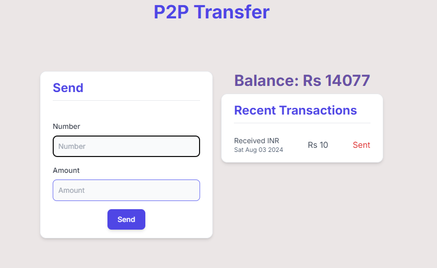
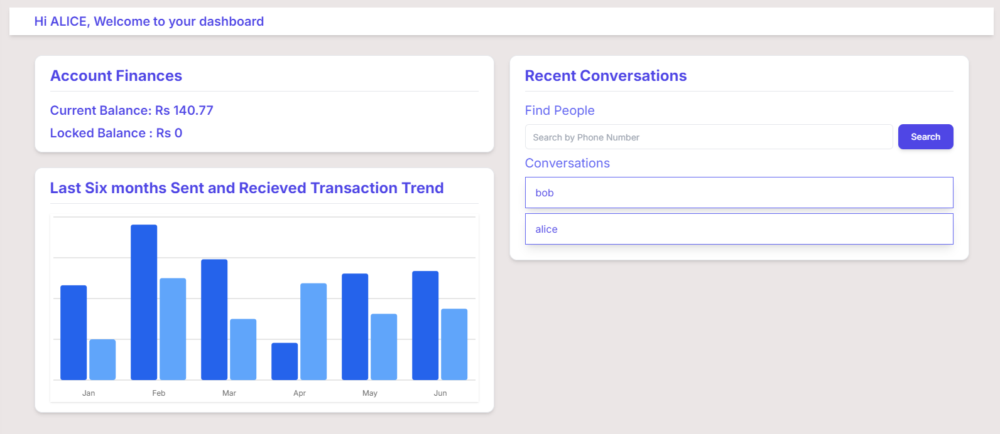
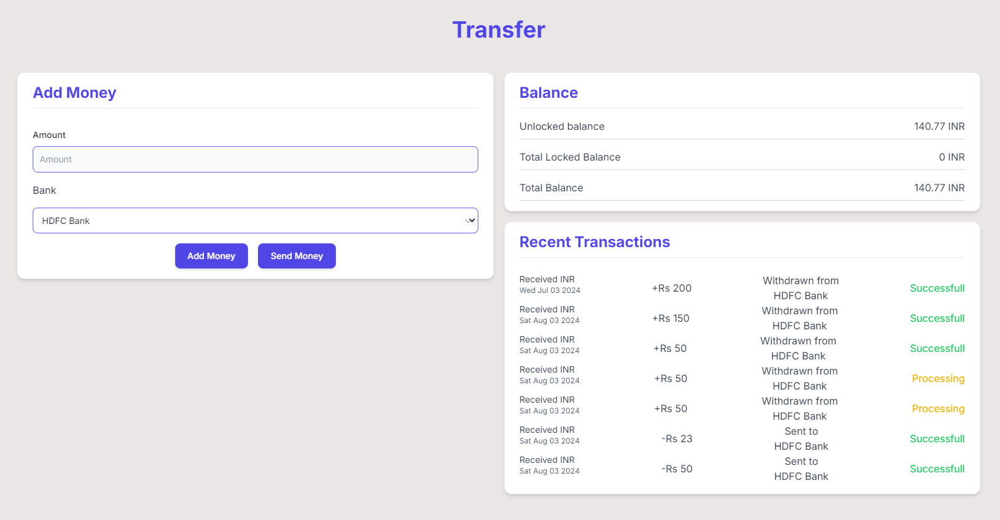
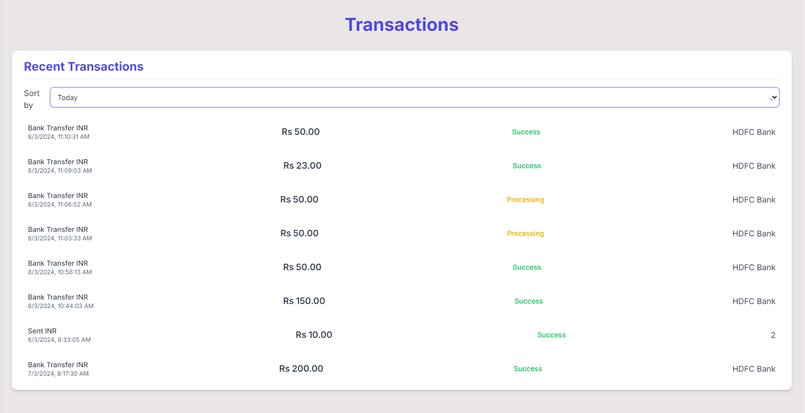

# [EzPay](https://ezpay.69xdev.in/)

Ezpay is a prototype wallet web application.

## Features

- **Send Money to  your Friends or pay to Businesses** Users can do p2p transactions as well as onramp and offramp bank transactions.

- **Interactive Dashboard:** There is an interactive dashboard that have various charts to show user transactions and spending in a fun way.
  
- **Chat with friends:** Users can chat with  users and request or send money.
    
- **All Transactions in  one place:** All the transactions can be seen in one place and the  users can also  sort  their transactions by days and months.
  


- Clone the repo

```jsx
git clone https://github.com/100xdevs-cohort-2/week-17-final-code
```

- npm install
- Run postgres either locally or on the cloud (neon.tech)

```jsx
docker run  -e POSTGRES_PASSWORD=mysecretpassword -d -p 5432:5432 postgres
```

- Copy over all .env.example files to .env
- Update .env files everywhere with the right db url
- Go to `packages/db`
    - npx prisma migrate dev
    - npx prisma db seed
- Go to `apps/user-app` , run `npm run dev`
- Try logging in using phone - 1111111111 , password - alice (See `seed.ts`)
